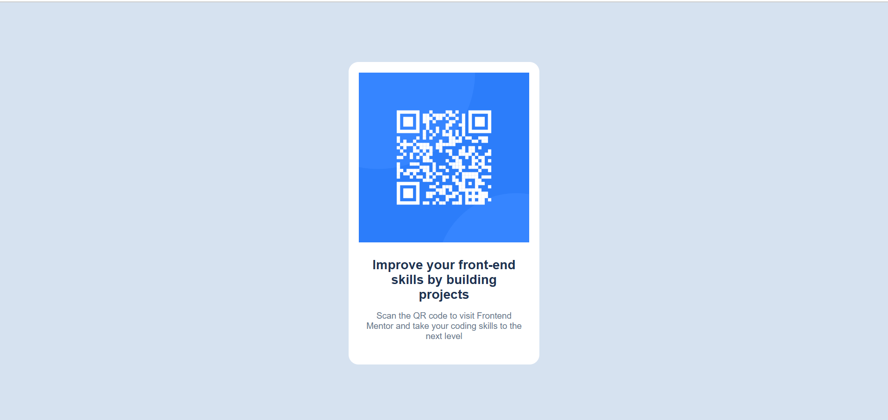

Screenshot

Links

- Solution URL:
- Live Site URL:

  Built with
- Semantic html5 markup
- css custom properties
- css flexbox model

What I learnt?

I am a beginner to the web development .This project taught me how to use css flexbox model and use properties like justify content ,align items in a proper way .other than that I learnt how to use the other basic properties like text align ,background color etc

Author

- Website -Hemant Kumawat
- Frontend Mentor - @HemantKumawat1729
- Twitter - **@CodeWithHemant**
